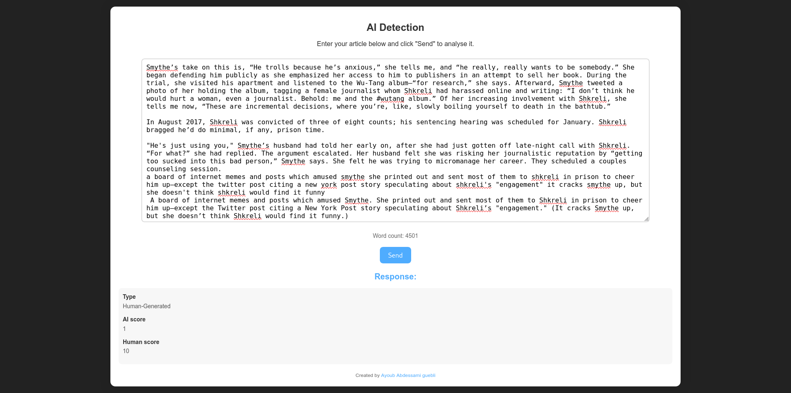

# AI text Detector 
this is an application web for the model we trained to detect text is it AI-generated or Human-written.

# setup 
first you need to download the trained model ( will upload the link later ) and extract it inside this repo
then you should install the requirements on your virtual environment ( search how to create virtual environment, it's not hard )

```bash
  virtualenv env                    # create virtual eniveronement
  source ./env/bin/activate         # or ".\env_name\Scripts\activate" for windows
  pip install -r requirements.txt   # install the requirement
```
after installing the requirement , we need to download the next 2 Corpus by nltk, so first change the download path to your environment, on terminal, execute the next:
```bash
export NLTK_DATA=./env/nltk_data 
```
then python, tun the next code to download the 2 corpus: 

```python
import nltk
nltk.download('brown')
nltk.download('wordnet')
```
there is a problem on *wordnet* corpus , so we need to unzip it too , so we should execute the next command:

```bash
unzip ./env/nltk_data/corpora/wordnet.zip -d ./env/nltk_data//corpora/   # or the path to your zip file 
```
now we ready to run the website
```bash
python manage.py runserver
```
<div align="center">
  
</div>

